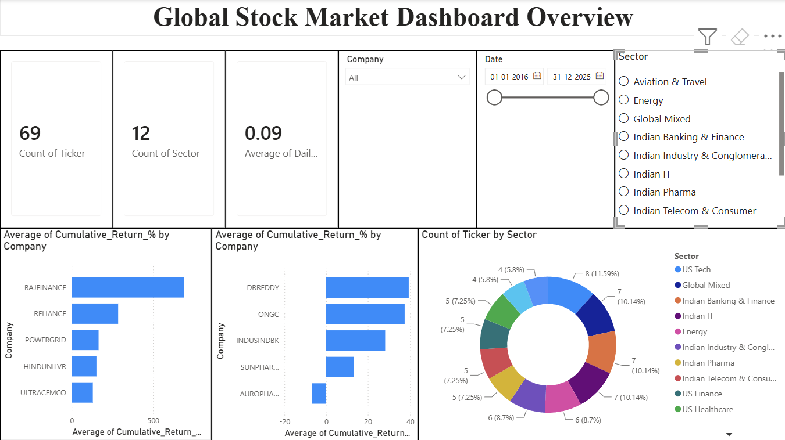

# Global Stock Market Financial Dashboard

An interactive 4-page Power BI dashboard analyzing **69 stocks across 12 sectors** 
from both Indian (NSE) and US markets over a **10-year period (2016–2025)**.
Data fetched live using Python's yfinance library.

## 📊 Dashboard Pages

### Page 1 — Overview
- KPI Cards: Total Stocks (69), Total Sectors (12), Avg Daily Return
- Top 10 Best Performing Stocks by Cumulative Return
- Top 10 Worst Performing Stocks
- Sector Distribution Donut Chart
- Interactive Year, Company, and Sector slicers

### Page 2 — Price & Volume Analysis
- Stock Price Trend with MA_20, MA_50, MA_200 moving averages
- Trading Volume over time (column chart)
- Daily High vs Low price range
- Company dropdown slicer for individual stock analysis

### Page 3 — Risk & Returns Analysis
- Top 10 stocks by Cumulative Return %
- Top 10 most volatile stocks (Volatility_20d)
- Risk vs Return scatter chart — all 69 stocks plotted by sector

### Page 4 — Sector Comparison
- Average Cumulative Return by Sector
- Average Volatility by Sector
- Sector price trend lines (2016–2025)
- Date range and Sector slicers

## 🔍 Key Insights

- **Indian Industry & Conglomerates** delivered the highest cumulative returns 
  over 10 years — driven by Adani and Tata group expansion
- **US Tech** is the most volatile sector — AI boom created massive price swings
- **Adani Enterprises, Bajaj Finance, Persistent Systems** are the top 3 
  individual performers
- **AMD and Tesla** are the most volatile individual stocks
- **2020 volume spike** visible across all stocks — COVID market chaos
- **NVDA** shows explosive growth from 2023 — entirely AI-driven
- Indian stocks dominate top performers — outperforming US counterparts 
  over the full 10-year period

## 🛠️ Tech Stack

- **Python** — yfinance, pandas (data fetching and processing)
- **Power BI Desktop** — dashboard building and DAX measures
- **Excel** — intermediate data storage

## 📈 Stocks Covered — 12 Sectors

| Sector | Stocks |
|---|---|
| Indian Banking & Finance | HDFCBANK, ICICIBANK, SBIN, AXISBANK, BAJFINANCE, KOTAKBANK, INDUSINDBK |
| Indian IT | TCS, INFY, WIPRO, HCLTECH, TECHM, MPHASIS, PERSISTENT |
| Indian Industry & Conglomerates | RELIANCE, TATAMOTORS, TATASTEEL, ADANIENT, MARUTI, ULTRACEMCO |
| Indian Pharma | SUNPHARMA, DRREDDY, CIPLA, DIVISLAB, AUROPHARMA |
| Indian Telecom & Consumer | BHARTIARTL, HINDUNILVR, NESTLEIND, TITAN, DMART |
| US Tech | AAPL, MSFT, GOOGL, AMZN, NVDA, META, TSLA, AMD |
| US Finance | JPM, GS, BAC, V, MA |
| US Healthcare | JNJ, PFE, ABBV, MRK, UNH |
| Energy | ONGC, POWERGRID, NTPC, XOM, CVX, BP |
| Aviation & Travel | INDIGO, DAL, UAL, MAR |
| Real Estate | DLF, GODREJPROP, PLD, AMT |
| Global Mixed | NFLX, BABA, TSM, ASML, SAP, TM, BHP |

## 📁 Files

| File | Description |
|---|---|
| `Stock_Market_Dashboard.pbix` | Power BI source file |
| `Stock_Market_Dashboard.pdf` | Exported dashboard PDF |
| `fetch_stocks.py` | Python script to fetch live stock data |
| `stock_data.xlsx` | Processed dataset with all metrics |

## 💡 How to Run

1. Install dependencies: `pip install yfinance pandas openpyxl`
2. Run `fetch_stocks.py` to fetch latest data
3. Open `Stock_Market_Dashboard.pbix` in Power BI Desktop
4. Refresh data to load latest stock prices
